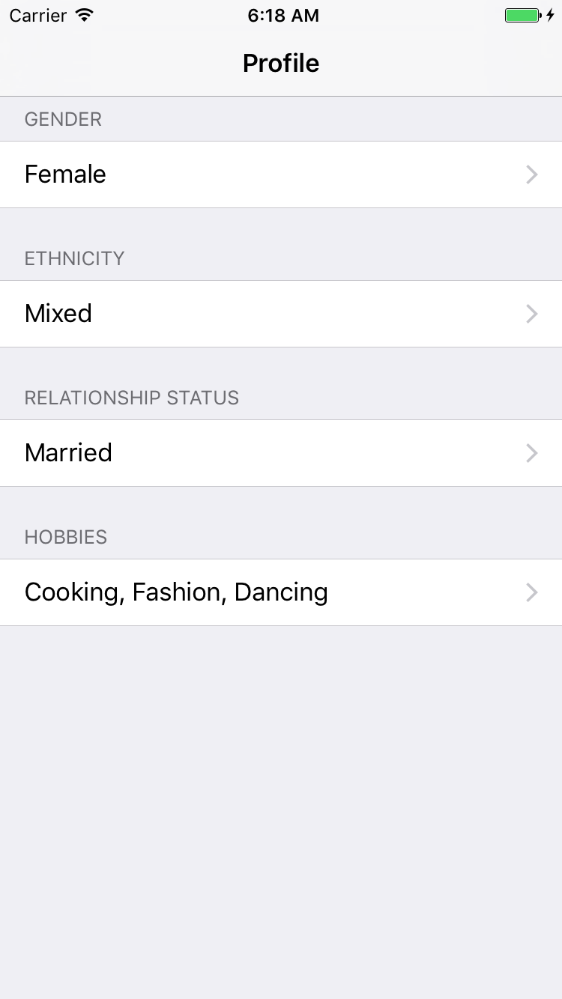
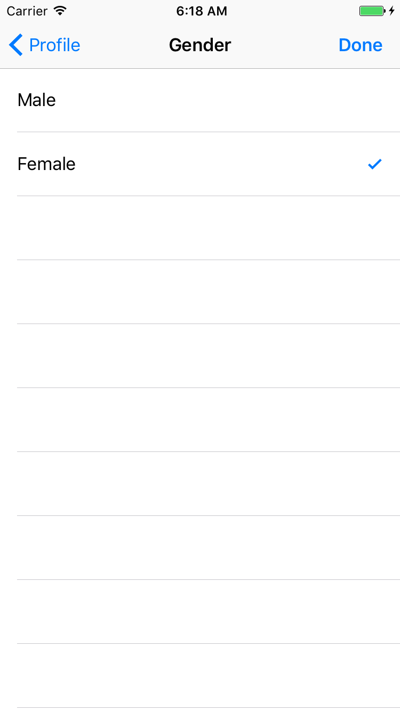
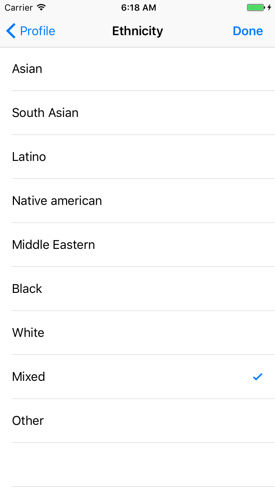
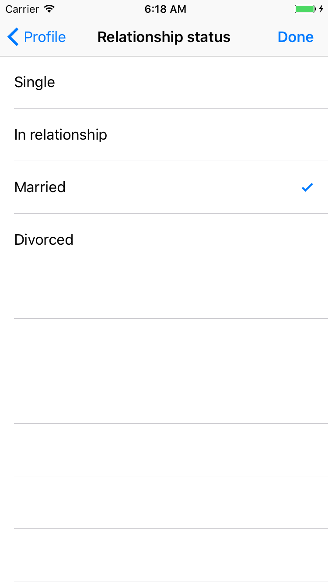
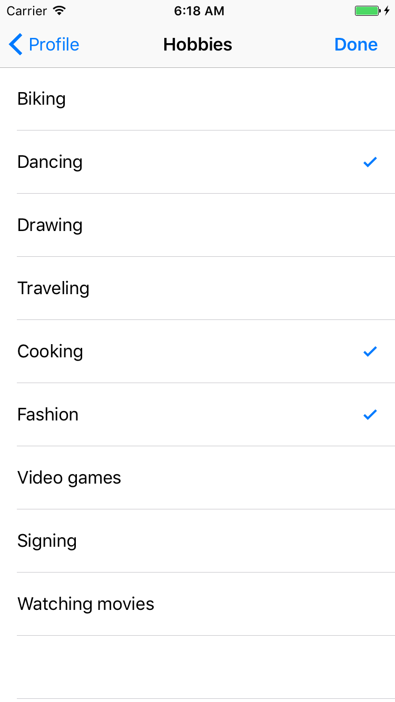

# GenericInfoSelectionViewController
This is an example that shows how you can use Swift Generics to optimize your code.

## Challenges
Users from your application have their basic profile information such as gender, ethnicity, relationship status and hobbies. All of these information can be updated as shown in screenshots below.

<p align="left" >
  
  
  
  
  
</p> 

As you can see, the functionalities in each screenshot are similar. The main difference is information type that user is updating.
So the challenge is how we can create one control that supports all different types of information.


## Step by step
Create data interfaces

```swift
// Info data interface
protocol TitleData {
    var title: String { get } // Used to display in UITableViewCell
}

protocol BasicInfoData: TitleData, Equatable {
    
}
```

```swift
// Table view data interface
protocol GenericInfoTableViewData {
    associatedtype DataType: BasicInfoData
    var title: String { get }
    var infoData: [DataType] { get }
    var allowsMultipleSelection: Bool { get }
}
```

<br/>
Make data type conform protocol BasicInfoData. Below is an example for Gender data type:

```swift
enum Gender {
    case male
    case female
}

extension Gender: BasicInfoData {
    var title: String {
        switch self {
        case .male: return "Male"
        case .female: return "Female"
        }
    }
}
```

<br/>
Create GenericInfoSelectionViewController that has *viewData* as a generic data type of GenericInfoTableViewData. Later on, the controller being given a specific type, decides what data will be shown in its view. 

```swift
class GenericInfoSelectionViewController<ViewDataType: GenericInfoTableViewData>: UITableViewController {
    var viewData: ViewDataType? {
        didSet {
            if viewIfLoaded != nil {
                tableView.reloadData()
            }
        }
    }
    
    init(viewData data: ViewDataType) {
        super.init(style: UITableViewStyle.plain)
        viewData = data
    }
}
```

<br/>
Now that we have our generic view controller that has abstract data type of GenericInfoTableViewData. It is time to make a specific view controller for updating user gender. First, we need to create GenderTableViewData to inject to our new view controller.

```swift
struct GenderTableViewData: GenericInfoTableViewData {
    var title: String { return "Gender" }
    
    var infoData: [Gender] {
        return [
            Gender.male,
            Gender.female
        ]
    }
    
    var allowsMultipleSelection: Bool { return false }
}
```

<br/>
GenderTableViewData has *infoData* array has 2 possible values Male and Female for users to choose from, *allowsMultipleSelection* is *false* as gender must be only one value.
Now our new view controller is:

```swift
class GenderSelectionViewController: GenericInfoSelectionViewController<GenderTableViewData> {
    init() {
        super.init(viewData: GenderTableViewData())
    }
}
```
<br/>
We just created GenderSelectionViewController from GenericInfoSelectionViewController with some simple additional work. For the rest(view controllers) and more detail, please check the project. 

## Author

Tung Vo

tung98.dn@gmail.com

## License

GenericInfoSelectionViewController is available under the MIT license. See the LICENSE file for more info.
